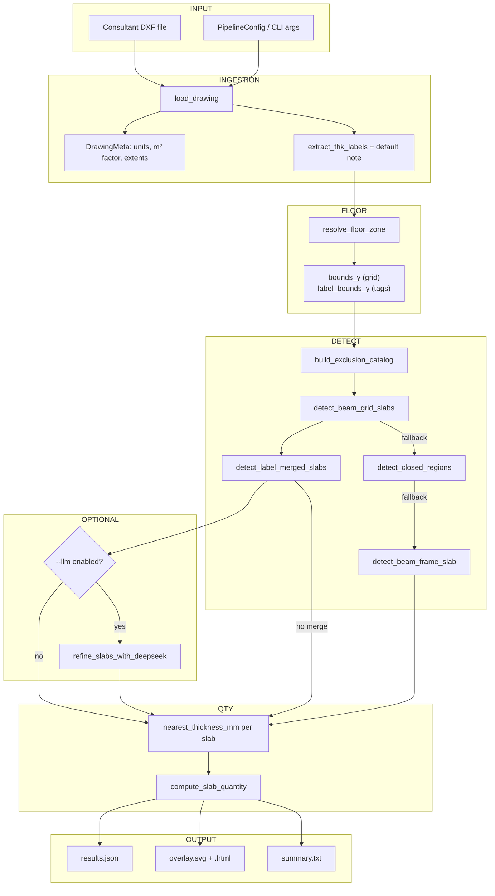
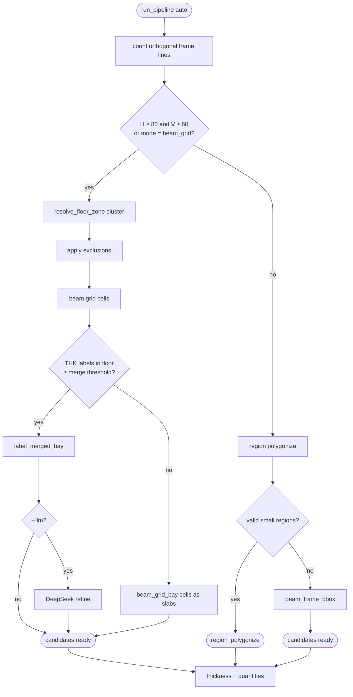
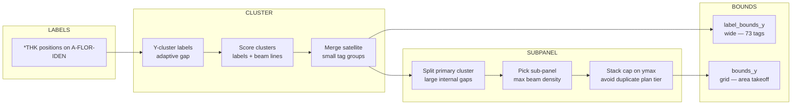
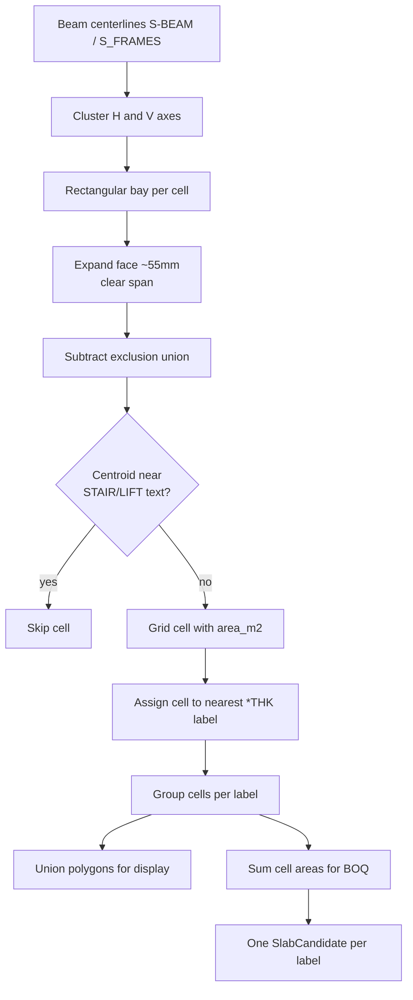
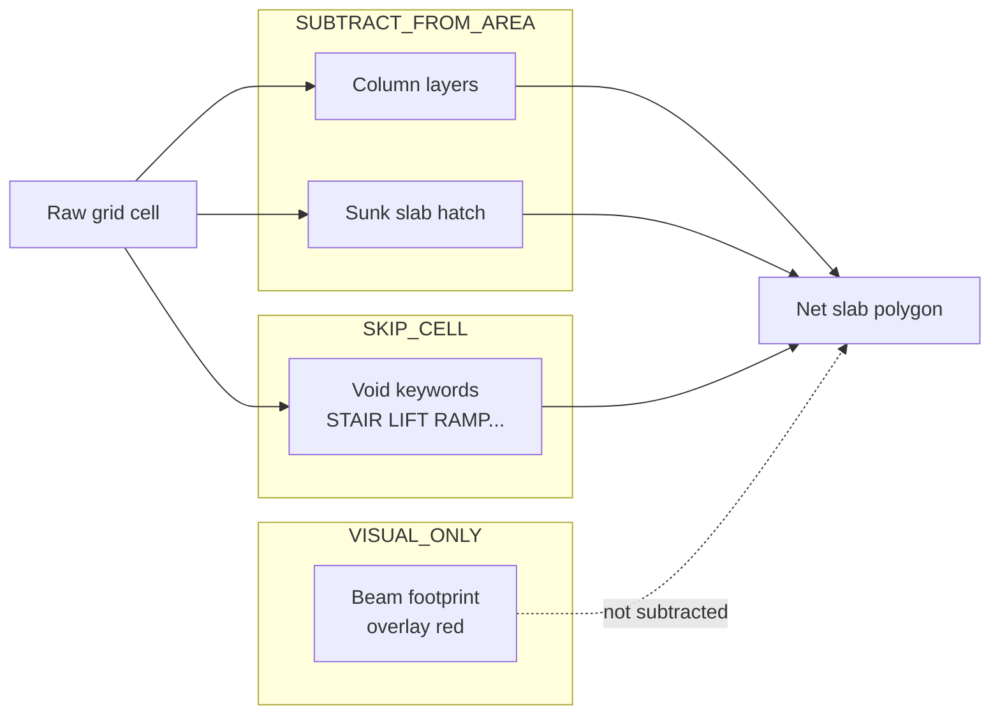
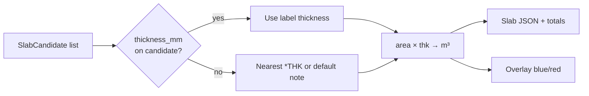
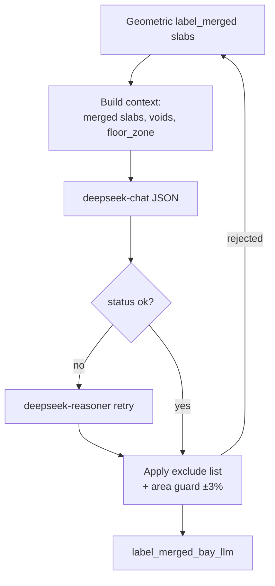
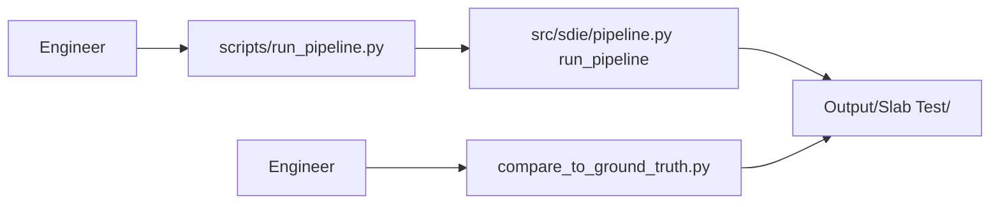

# SDIE — Pipeline Flowcharts

Mermaid diagrams render in Cursor’s Markdown preview (open this file → preview).

**Related:** [01_SIMPLE_OVERVIEW.md](./01_SIMPLE_OVERVIEW.md) · [02_ARCHITECTURE.md](./02_ARCHITECTURE.md)

---

## 1. End-to-end pipeline



---

## 2. Auto mode — strategy selection



---

## 3. Floor zone (cluster mode)



---

## 4. Beam grid → one slab per THK tag



---

## 5. Exclusions vs slab area



---

## 6. Quantity and export



---

## 7. Optional DeepSeek path



---

## 8. CLI entry point



**Example:**

```text
python scripts/run_pipeline.py  "Data Source/.../Drawing.dxf"  -o "Output/Slab Test"  --mode auto  --layers S-BEAM  --min-area 0.4
```

---

## 9. Reading order

| # | Document | Best for |
|---|----------|----------|
| 1 | [01_SIMPLE_OVERVIEW.md](./01_SIMPLE_OVERVIEW.md) | First read — concepts |
| 2 | [02_ARCHITECTURE.md](./02_ARCHITECTURE.md) | Modules and design rules |
| 3 | **This file** | Visual flow |
| 4 | [NEW_DRAWING_GUIDE.md](./NEW_DRAWING_GUIDE.md) | Next drawing test |
