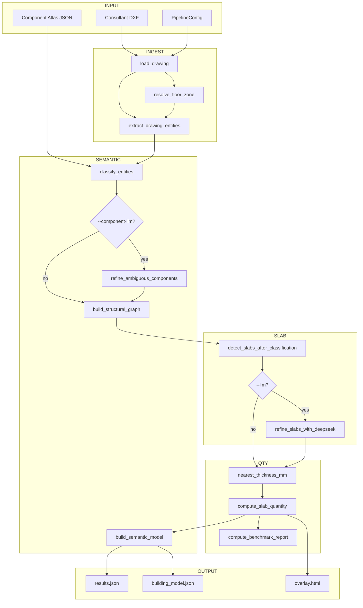
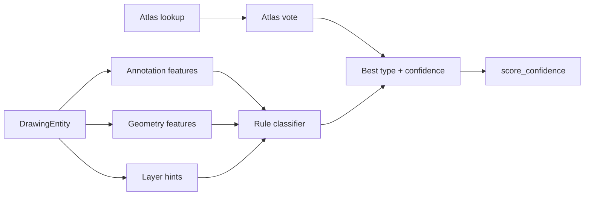
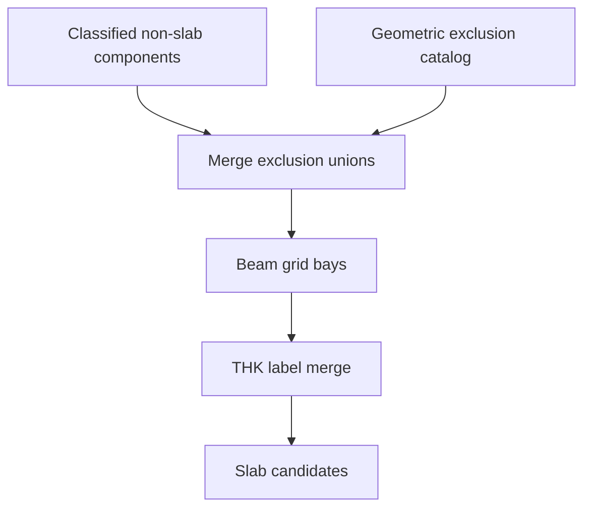
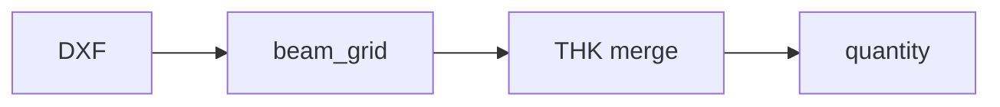
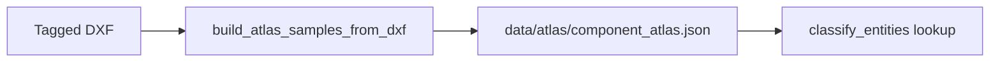

# SDIE v3.3 — Pipeline Flowcharts

Mermaid diagrams render in Cursor Markdown preview (`Ctrl+Shift+V`).

---

## 1. v3.3 semantic pipeline (default)

---

## 2. Component classification flow

---

## 3. Slab Intelligence (Epic 5)

---

## 4. Legacy geometry-first path

Use `--legacy-geometry` to skip semantic stages and run the v2 `pipeline.py` body directly.

---

## 5. Atlas builder (Epic 1)

---

## Related

- [01_SIMPLE_OVERVIEW.md](./01_SIMPLE_OVERVIEW.md)  
- [02_ARCHITECTURE.md](./02_ARCHITECTURE.md)  
- [04_CODE_GUIDE.md](./04_CODE_GUIDE.md)
