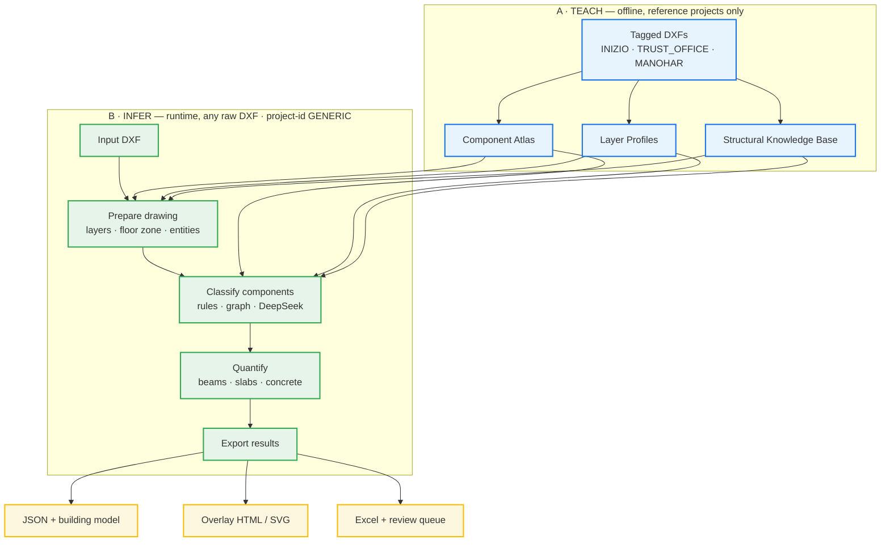
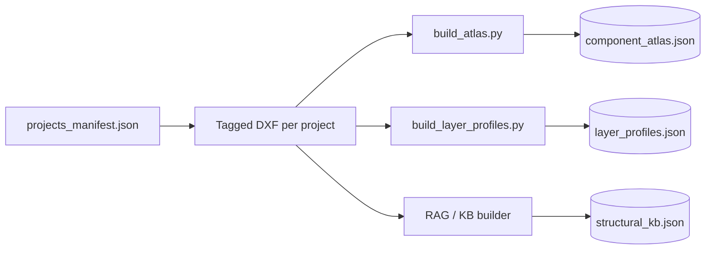
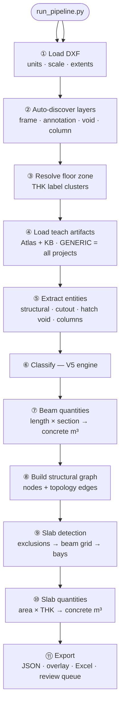
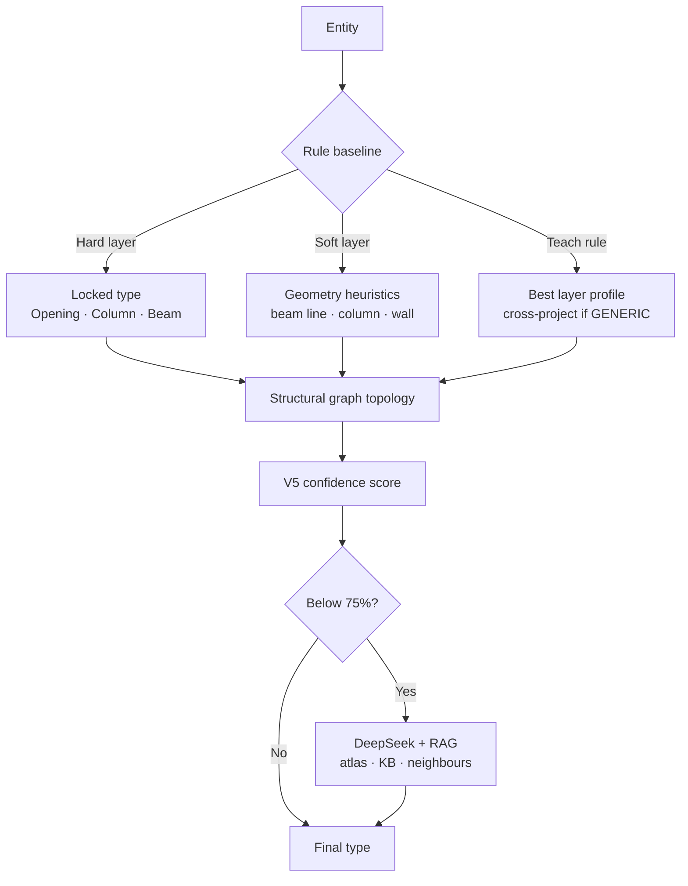
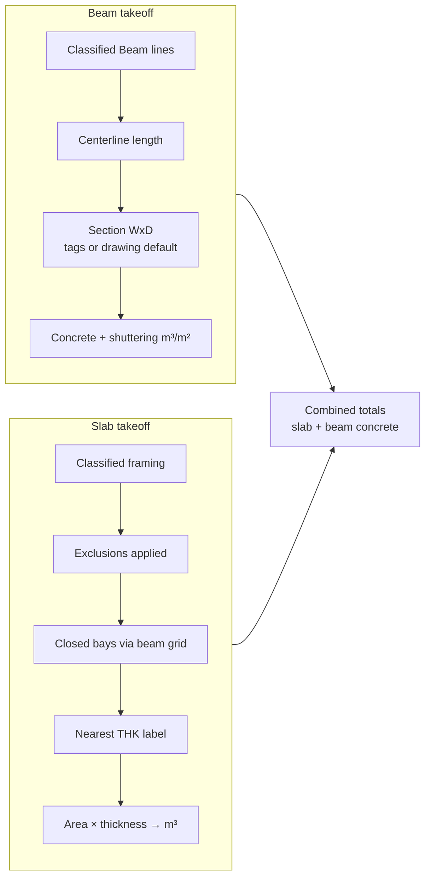

# SDIE V6 — Model Flow

Structural Drawing Intelligence Engine: **teach from reference projects → infer on any drawing → quantify slabs and beams.**

---

## 1. End-to-end flow (single view)

---

## 2. Teach pipeline (Phase A)

| Artifact | What it stores |
|----------|----------------|
| **Atlas** | Labelled geometry samples per layer and entity type |
| **Layer profiles** | Hard globals, soft layers, per-project rules + confidence |
| **Knowledge base** | Layer rules, annotation patterns, estimator mappings |

---

## 3. Inference pipeline (Phase B) — step by step

---

## 4. Classification engine (V5)

**Excluded from slab area:** Shear Wall, Structural Wall, Lift Core, Stair Core, Shaft, Opening.

---

## 5. Quantity engines

**Slab fallback order:** beam-grid intelligence → region polygonize → beam-frame bbox.

---

## 6. Inference mode

| `project-id` | Knowledge used | When |
|--------------|----------------|------|
| **GENERIC** *(default)* | All teach projects merged | New / unknown drawings |
| INIZIO | Inizio + GLOBAL | Teach evaluation |
| TRUST_OFFICE | Trust + GLOBAL | Teach evaluation |

---

## 7. Key CLI flags

| Flag | Default | Purpose |
|------|---------|---------|
| `--project-id` | GENERIC | Teach knowledge scope |
| `--auto-layers` | on | Discover layers from DXF |
| `--no-deepseek` | off | Skip DeepSeek reasoning pass |
| `--no-beam-quantities` | off | Skip beam takeoff |
| `--llm` | off | Optional slab bay DeepSeek refinement |

API key: `DEEPSEEK_API_KEY` in `Phase2_Concrete_Estimation/.env`

---

## 8. Output files

| File | Contents |
|------|----------|
| `{drawing}_results.json` | Full run: classification, slabs, beams, totals |
| `{drawing}_building_model.json` | Semantic model + graph + quantities |
| `{drawing}_overlay.html` | Interactive component overlay |
| `{drawing}_quantities.xlsx` | Summary · Slabs · **Beams** · Classification |
| `{drawing}_review_queue.json` | Low-confidence entities |
| `{drawing}_summary.txt` | Human-readable summary |

---

## 9. Progress bar stages

| % | Stage |
|---|--------|
| 2–8 | Load DXF |
| 10–12 | Discover layers · floor zone |
| 15–25 | Load atlas · extract entities |
| 28–55 | Classify (rules → DeepSeek batches) |
| 56–57 | **Beam quantities** |
| 58–60 | Structural graph |
| 62–82 | Slab detection |
| 85–92 | Slab quantities · write outputs |
| 100 | Complete |

---

*SDIE V6 · P2_SlabVersion6 · Teach-then-infer structural estimation*
